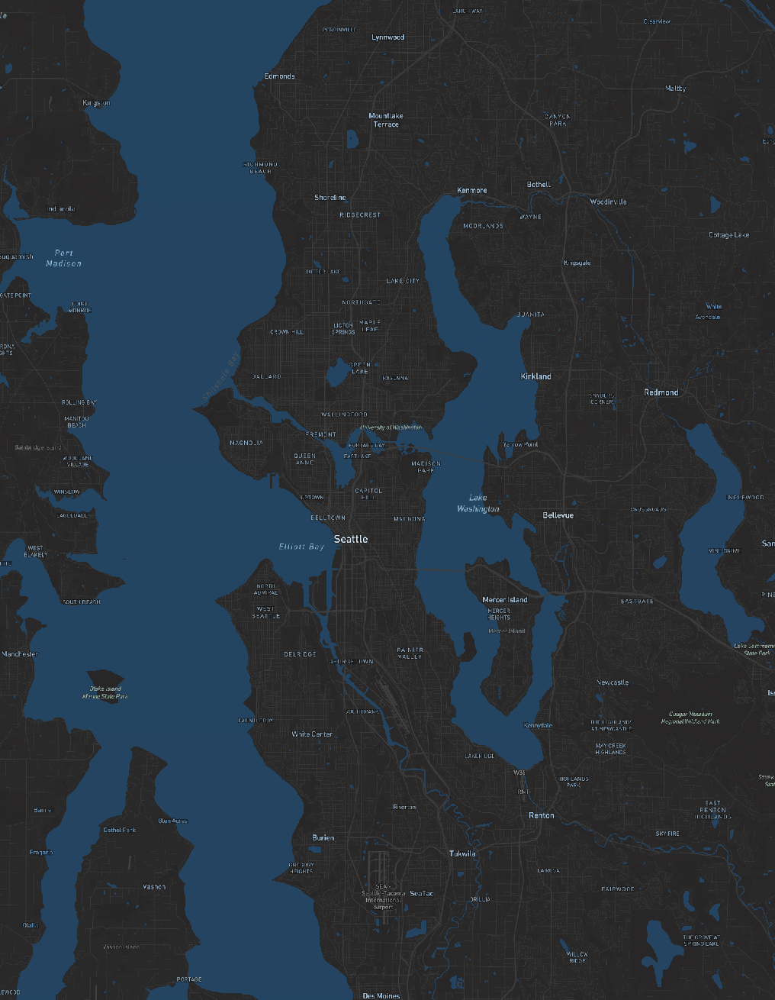
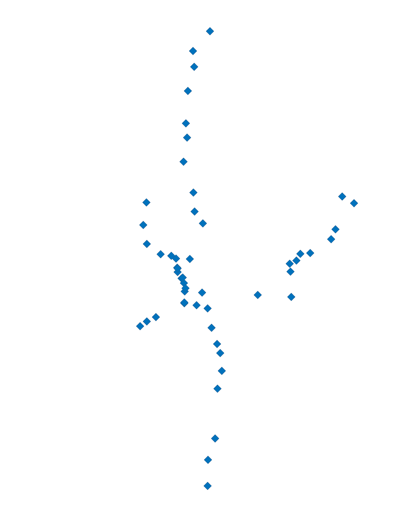
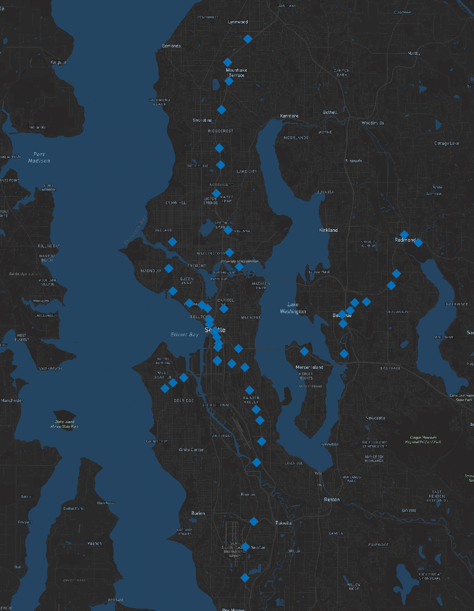
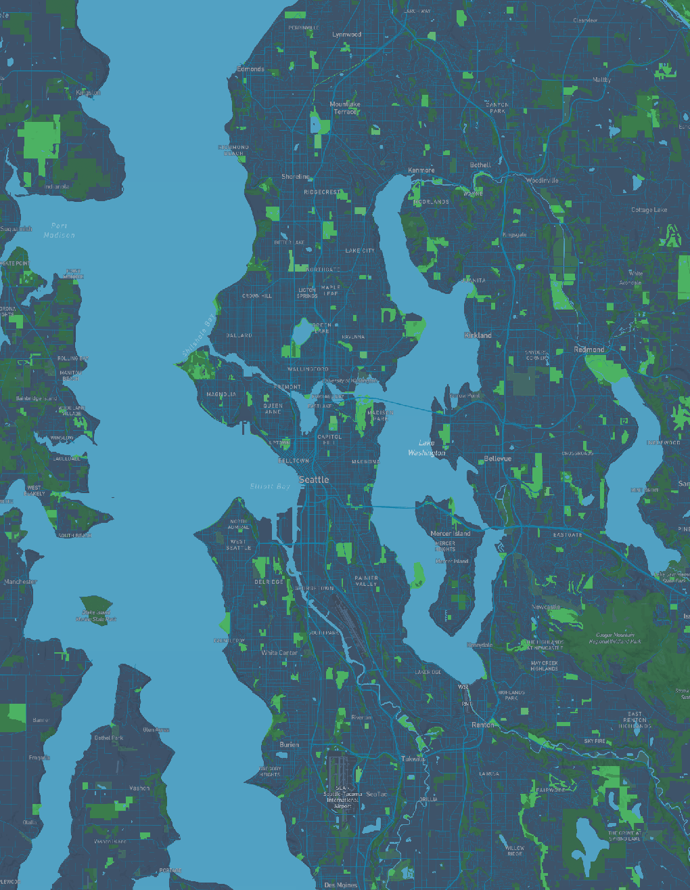

## Seattle Tile Map Collection

This repo contains four different tile sets built with Mapbox, QGIS, and QMetaTiles. All four tile sets focus on Seattle, Washington, and were exported at zoom levels 10–14.

### Web Map Link
The web map can be found here:
[Live Web Map](https://yiyun-jiang.github.io/seattle-tile-map/index.html)

### Screenshots of the Four Tile Layers

#### 1. Custom Basemap

A simple basemap edited from Mapbox Dark style. I changed the water color and adjusted some label styles.
{ width=300px }

#### 2. Light Rail Stations

A point layer showing Link light rail station locations. I styled the points in QGIS and exported them as raster tiles.
{ width=300px }

#### 3. Basemap + Stations

This one combines Tile Set 1 and Tile Set 2 into a single tile set. It shows the basemap with the station points on top.
{ width=300px }

#### 4. Sound Transit Theme

A themed map I designed in Mapbox Studio using Sound Transit colors.
{ width=300px }
